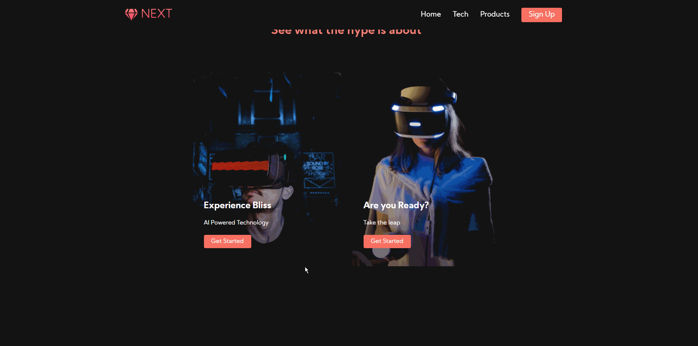
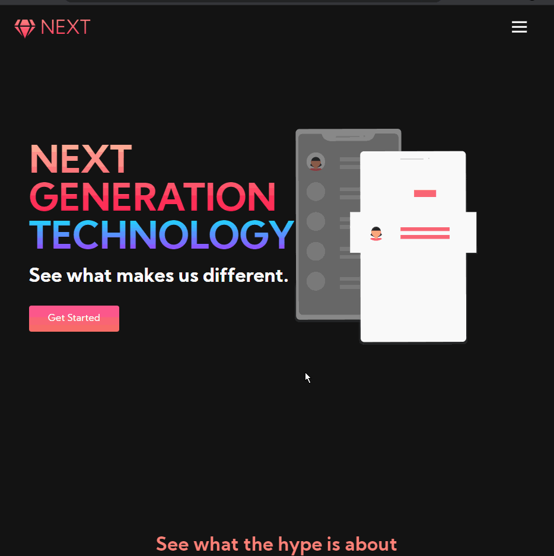

# Next-Site

**Next-Site** is a website for that talks about the next upcoming innovation in tech from the made up company Next.

Submitted by: **Rabiul Mazumder**

Time spent: **2** days spent in total

## Functionality
The purpose of this website is to explore more on the front end design up websites and to see more of the power that HTML and CSS have to make the user experience more dynamic and interactive. When hovering over buttons there are varying animations that play depending on when the user hovers over the buttons. For the "Sign Up" button the default color is Pink and when hovered over it transitions to the color purple. The "Get Started" button is a Pink gradient button and when hovered over the color purple slides in from the left to entirely color the button to purple. For the Servies Buttons when hovered over the buttons it expands to prompt the user to click on. When the websites screen is half-screen the accommodate for the lack of space for the navigation bar it transforms into a Hamburger menu button so when click on it shows all the options from the navigation bar that was there when the website is at fullscreen which are "Home, Tech, Products."

## Video Walkthrough

Here's a walkthrough of the Next-Site:

GIF created with [LiceCap](http://www.cockos.com/licecap/).

## Resources
- fontawesome.com (Used to add fonts icons)
- undraw.co (Used to get Open-source illustrations)
- Google Fonts (Used the font Kumbh Sans to change the font)
- pexels.com (Used to get free stock photos and videos)
